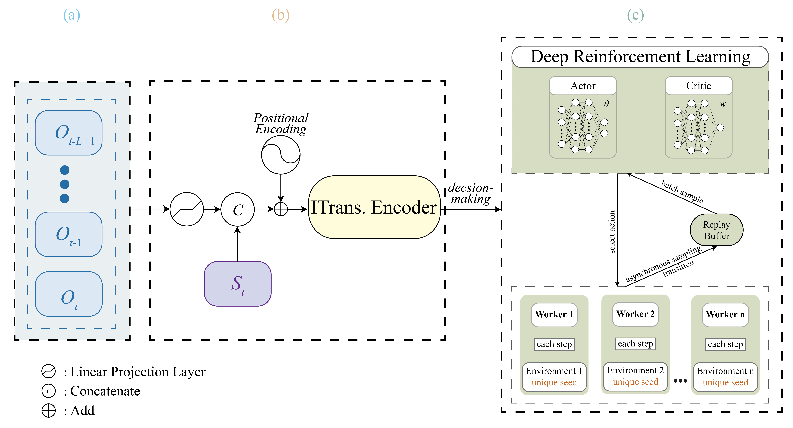

# ITEMARL: Improved Transformer Encoder in Multi-threaded Asynchronous Reinforcement Learning for UAV Target Tracking

The implementation of ITEMARL: Improved Transformer Encoder in Multi-threaded Asynchronous Reinforcement Learning for UAV Target Tracking.


Our framework is shown in the following figure:
<div align="center">
    
</div>

## Installation
### Networks are trained using PyTorch 1.13.1 and Python 3.7.
```bash
pip install -r requirements.txt
```

## Train
### The scenario of L=12, P=0.8：
```bash
bash scripts/run_train.sh 12 0.8 itemarl_td3
```
Training results will be saved in the results/itemarl_td3_L12_P0.8 directory.

### By adjusting the observation sequence length (L) and information dropout probability (P), you can train models in various scenarios with different difficulty levels:
```bash
bash scripts/run_train.sh [L] [P] [algorithm]
```
Training results will be saved in the results/[algorithm]_L[L]_P[P] directory.

## Evaluation
### The scenario of L=12, P=0.8：
```bash
bash scripts/run_eval.sh 12 0.8 itemarl_td3
```
Evaluation results (eval_summary_all_seeds.txt) will be outputted to the results/itemarl_td3_L12_P0.8 directory.


## Ablation Study
### Run ablation experiments: 
The experiment name can be any name in configs/ablation.yaml,
 for example: "transformer_original", "thread_0", "thread_1", "thread_2",
              "thread_3", "thread_4", "thread_5" "thread_6", "thread_7", "thread_8",
              "curriculum_static", "curriculum_none"
```bash
bash scripts/run_ablation.sh --experiment transformer_original --seq_len 12 --p_drop 0.2
```

### Run ablation experiments evaluation：
```bash
bash scripts/run_ablation_eval.sh --experiment transformer_original 
```

Ablation results evaluation (summary.txt) will be saved in the results/ablation/transformer_original/eval directory.


